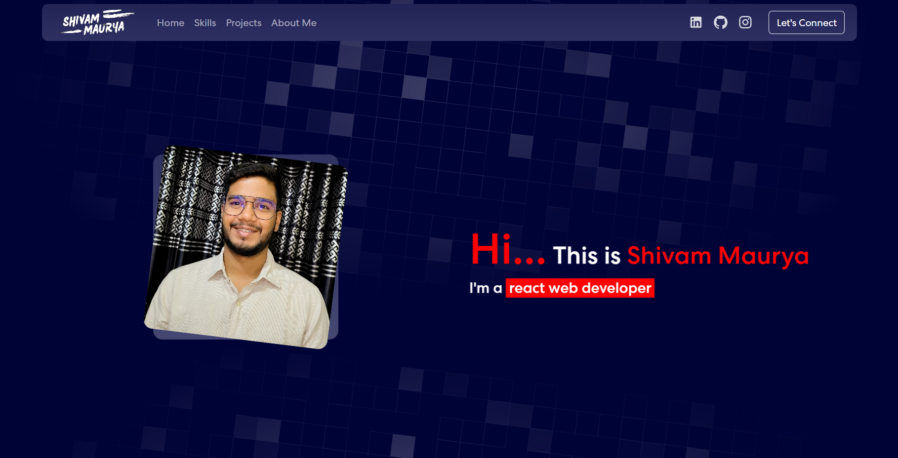
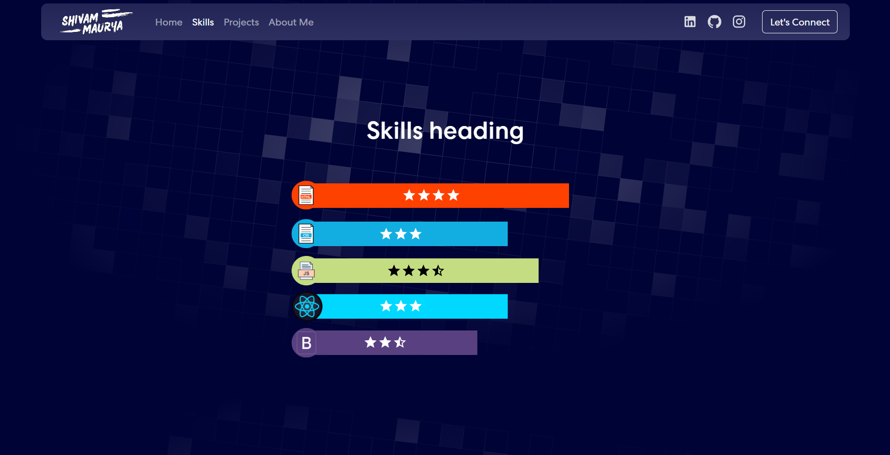
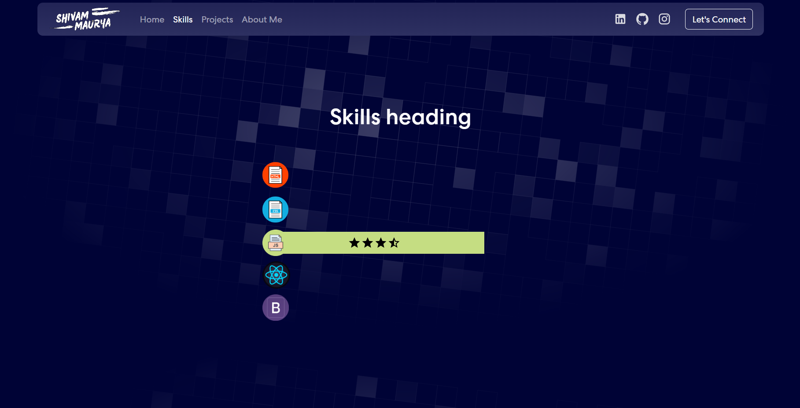

# My Portfolio Website

This is a React project in which I made my portfolio site with my project, experience and other details.

## Table of contents

-   [Overview](#overview)
    -   [The Theme](#the-theme)
    -   [Screenshot](#screenshot)
    -   [Links](#links)
-   [My process](#my-process)
    -   [Built with](#built-with)
    -   [What I learned](#what-i-learned)
    -   [Continued development](#continued-development)
    -   [Useful resources](#useful-resources)
-   [Author](#author)

## Overview

### The Theme

Users should be able to:

-   View the details of my portfolio.
-   Can hover and see my skills and can also hover the individual images for its skill details.
-   Navigate through the navbar and the footer with links to my socials.

### Screenshot

| Main Page                                                                |
| ------------------------------------------------------------------------ |
|  |

| Hover State                                                                  | Individual Hover State                                                                             |
| ---------------------------------------------------------------------------- | -------------------------------------------------------------------------------------------------- |
|  |  |

### Links

-   [Github Solution](https://github.com/ShivamManiMaurya/my_portfolio_website)
-   [Live Site](https://shivammanimaurya.github.io/my_portfolio_website/)

## My process

### Built with

-   HTML5
-   CSS custom properties
-   Flexbox
-   JavaScript
-   Bootstrap
-   [React](https://reactjs.org/) - JS library

### What I learned

-   Get more familiar with overflow CSS property
-   Get more familiar with ::-webkit-scrollbar in CSS
-   Get more familiar with transition and transform CSS property
-   Get more familiar with animations in CSS
-   Get more familiar with Bootstrap
-   Get more familiar with the functional programming aspect of reactJs

### Useful resources

-   [Web Dev Simplified](https://www.youtube.com/@WebDevSimplified) - He helped me in understanding the core concepts of bootstrap.
-   [Kevin Powell](https://www.youtube.com/@KevinPowell) - Kevin Powell helped me in understanding some concepts in css

## Author

-   Website - [Shivam Maurya](https://shivammanimaurya.github.io/my_portfolio_website/)
-   GitHub Page - [Shivam Maurya GitHub](https://github.com/ShivamManiMaurya)
-   Linkedin - [@shivammanimaurya](https://www.linkedin.com/in/shivammanimaurya)
